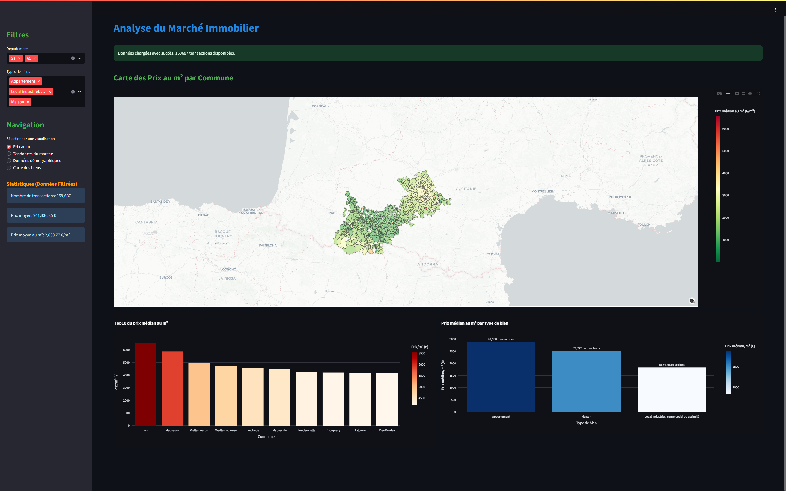
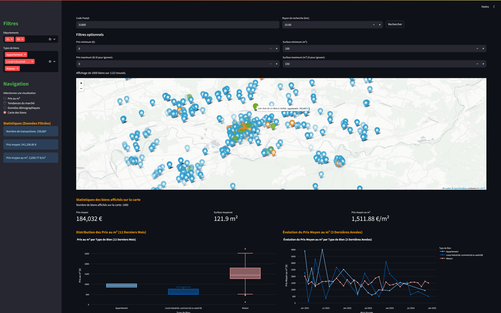

# real estate market analyzer

### base

utilise le venv déjà créé
utilise uv pour manager les dépendances et le rest de l'application

### extraire les données du marché immobilier

utilise les données des fichiers csv dans le dossier `data` pour extraire les informations suivantes :

-   données sur les prix des logements
-   données sur les quartiers et les villes
-   données sur les types de logements
-   données sur les tendances du marché
-   données sur la population et les revenus
-   données sur les types de logements et les caractéristiques

### visualiser les données

utiliser streamlit pour :

1. afficher une carte des prix au mètre carré et par quartier quand c'est possible autrement par ville
2. afficher les tendances du marché
3. afficher les données démographiques
4. afficher un point sur la carte pour chaque logement avec les informations sur le logement

### Exemple d'utilisation
